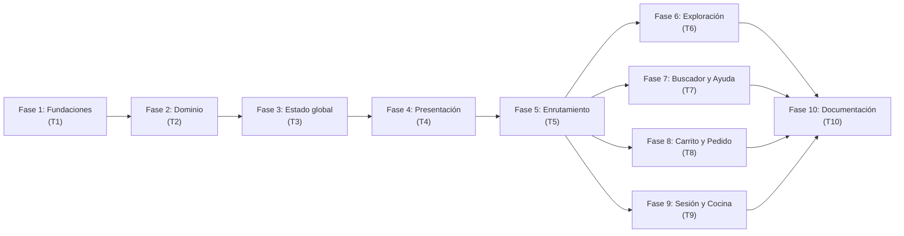

# Plan de Desarrollo: Comedor IPF

## Fase 1: Fundaciones (T1)

### Objetivo
Preparar el proyecto para el desarrollo: limpiar la plantilla, configurar el tema, instalar herramientas de testing y establecer la base del proyecto.

### Secciones de la spec que cubre
- Sección 2 (Stack y restricciones técnicas)
- Sección 3 (Arquitectura, árbol de carpetas — estructura base)
- Sección 10 (Tema y paleta)
- Sección 13 (Estrategia de testing — configuración)

### Archivos involucrados

#### A eliminar (restos de la plantilla)
- `src/app/explore.tsx`
- `src/app/index.tsx` (contenido de ejemplo; se reemplaza en T6)
- `src/components/animated-icon.tsx`, `animated-icon.web.tsx`, `animated-icon.module.css`
- `src/components/app-tabs.tsx`, `app-tabs.web.tsx`
- `src/components/external-link.tsx`
- `src/components/hint-row.tsx`
- `src/components/themed-text.tsx`
- `src/components/themed-view.tsx`
- `src/components/web-badge.tsx`
- `src/components/ui/collapsible.tsx`
- `src/constants/theme.ts`
- `src/hooks/use-color-scheme.ts`, `use-color-scheme.web.ts`, `use-theme.ts`
- `src/global.css`

#### A crear
- `src/tema/colores.ts` — paleta institucional y constantes de espaciado/radios
- `jest.config.js` — configuración de Jest con preset `jest-expo`
- `jest.setup.ts` — setup de mocks (Reanimated, Gesture Handler si necesario)

#### A modificar
- `app.json` — cambiar `userInterfaceStyle` a `"dark"`
- `package.json` — agregar script `"test": "jest"`, agregar dependencias de testing
- `src/app/_layout.tsx` — limpiar (provisorio, se completa en T5)

### Orden de trabajo
1. Eliminar archivos de la plantilla.
2. Configurar `app.json` (`userInterfaceStyle: "dark"`, verificar `scheme` y `typedRoutes`).
3. Instalar `@expo/vector-icons` con `npx expo install`.
4. Instalar dependencias de testing: `npx expo install jest-expo jest @types/jest @testing-library/react-native --dev`.
5. Crear `jest.config.js` y `jest.setup.ts`.
6. Crear `src/tema/colores.ts`.
7. Crear layout raíz provisorio (mínimo funcional).
8. Crear `__tests__/` vacío con estructura base.
9. Verificar: `npx tsc --noEmit`, `npx jest` (0 tests, 0 errores).

### Riesgos y mitigación
| Riesgo | Mitigación |
|---|---|
| Reanimated/Gesture Handler requieren mocks en Jest | Configurar en `jest.setup.ts` siguiendo la documentación oficial |
| `@expo/vector-icons` podría ya estar incluido transitivamente | Verificar en `node_modules` antes de instalar |
| Eliminar archivos de la plantilla podría romper imports | Actualizar el layout raíz para no depender de los componentes eliminados |

### Estrategia de tests
- No hay tests funcionales en esta fase (solo configuración).
- Verificar que `npx jest` corre sin errores (0 test suites).
- Verificar que `npx tsc --noEmit` pasa.

---

## Fase 2: Dominio (T2)

### Objetivo
Implementar las estructuras de datos puras (`Pila`, `Cola`) y los datos estáticos (platos, ayuda, configuración).

### Secciones de la spec que cubre
- Sección 5 (Modelo de datos)
- Sección 6 (Contratos de Pila y Cola)
- Datos de la sección 9 (platos, ayuda, configuración)

### Archivos involucrados

#### A crear
- `src/estructuras/Pila.ts`
- `src/estructuras/Cola.ts`
- `src/data/platos.ts` — tipos `Plato`, `Categoria`, `CATEGORIAS`, 12+ platos, funciones auxiliares
- `src/data/ayuda.ts` — artículos de ayuda indexados por ruta
- `src/data/configuracion.ts` — credenciales fijas, `MINUTOS_POR_PEDIDO`
- `__tests__/estructuras/Pila.test.ts`
- `__tests__/estructuras/Cola.test.ts`
- `__tests__/data/platos.test.ts`

### Orden de trabajo (TDD)
1. Escribir tests de `Pila` (push, pop, tope, vacia, tamanio, aArray devuelve copia, LIFO).
2. Implementar `Pila<T>` hasta que los tests pasen.
3. Escribir tests de `Cola` (encolar, desencolar, frente, vacia, tamanio, aArray, no usa shift, compactación, muchas operaciones).
4. Implementar `Cola<T>` hasta que los tests pasen.
5. Implementar datos estáticos.
6. Escribir tests de funciones de `platos.ts`.

### Riesgos y mitigación
| Riesgo | Mitigación |
|---|---|
| Test de "no usa shift()" es difícil de automatizar | Grep en el archivo fuente como parte del test o como verificación separada |
| Campos `#` privados podrían tener problemas con Jest/transpilación | Verificar que el preset `jest-expo` soporta campos privados de JS |

### Estrategia de tests
- **Rojo → Verde**: escribir tests antes de implementar.
- Tests unitarios para `Pila`, `Cola`, funciones de `platos.ts`.
- Verificar compactación de `Cola` con muchas operaciones.

---

## Fase 3: Estado global (T3)

### Objetivo
Implementar el `ComedorContext`, `ComedorProvider` y el hook `useComedor` con toda la lógica de negocio.

### Secciones de la spec que cubre
- Sección 7 (Estado global completo)
- Sección 5 (Tipos `ItemCarrito`, `AccionCarrito`, `Pedido`)

### Archivos involucrados

#### A crear
- `src/context/ComedorContext.tsx`
- `__tests__/context/ComedorContext.test.tsx`

### Orden de trabajo (TDD)
1. Escribir tests del Context con `renderHook` y Provider como wrapper:
   - `useComedor` lanza error fuera del Provider.
   - Agregar al carrito incrementa cantidadItems y totalCarrito.
   - Deshacer último quita el ítem correcto.
   - Deshacer con pila vacía no hace nada.
   - Confirmar pedido: encola, vacía carrito, asigna turno correlativo.
   - Atender siguiente: desencola del frente, pushea a atendidos.
   - Sesión: iniciar con credenciales válidas/inválidas, cerrar.
   - `buscarTurno`: estados en-espera, atendido, inexistente.
2. Implementar `ComedorContext.tsx` hasta que todos los tests pasen.

### Riesgos y mitigación
| Riesgo | Mitigación |
|---|---|
| `renderHook` necesita el Provider como wrapper | Crear un wrapper helper en el test |
| Snapshots con `useRef` + `useState` podrían no re-renderizar correctamente | Seguir el patrón exacto del brief: `useRef` para la instancia, `useState` para la copia |

### Estrategia de tests
- **Rojo → Verde**: tests antes de implementar.
- Tests de lógica de estado con `renderHook`.

---

## Fase 4: Presentación (T4)

### Objetivo
Implementar todos los componentes reutilizables, incluyendo el desafío 1 (`TituloConContadorDePila`).

### Secciones de la spec que cubre
- Sección 9 (Componentes)
- Sección 11, desafío 1 (Contador de pila)

### Archivos involucrados

#### A crear
- `src/components/DondeEstoy.tsx`
- `src/components/Pantalla.tsx`
- `src/components/BotonPrimario.tsx`
- `src/components/TarjetaPlato.tsx`
- `src/components/TarjetaPedido.tsx`
- `src/components/MensajeEstado.tsx`
- `src/components/BotonCerrarSesion.tsx`
- `src/components/TituloConContadorDePila.tsx`
- `__tests__/components/` — tests de render, props y estados deshabilitados

### Orden de trabajo
1. Implementar `DondeEstoy` (con constante `DEBUG`).
2. Implementar `Pantalla` (contenedor con ScrollView + DondeEstoy).
3. Implementar `BotonPrimario` (variantes, estado deshabilitado, sin arrays de estilo).
4. Implementar `TarjetaPlato` (presentacional, `React.memo`).
5. Implementar `TarjetaPedido`.
6. Implementar `MensajeEstado`.
7. Implementar `BotonCerrarSesion`.
8. Implementar `TituloConContadorDePila` (desafío 1).
9. Escribir tests de componentes.

### Riesgos y mitigación
| Riesgo | Mitigación |
|---|---|
| `useNavigation().getState()` podría no funcionar fuera de un navigator en tests | Mockear `useNavigation` en el test de `TituloConContadorDePila` |
| `Link` con `asChild` + arrays de estilo | Aplanar con `StyleSheet.flatten`, comentar el problema |

### Estrategia de tests
- Tests de render con `@testing-library/react-native`.
- Tests de props y estados deshabilitados.

---

## Fase 5: Esqueleto de enrutamiento (T5)

### Objetivo
Crear todos los layouts reales y todas las rutas de la tabla como pantallas provisorias (`// STUB`).

### Secciones de la spec que cubre
- Sección 8 (Enrutamiento completo)
- Sección 3 (Árbol de archivos en `src/app`)

### Archivos involucrados

#### A crear/modificar
- `src/app/_layout.tsx` — Stack raíz completo (GestureHandlerRootView, Provider, NavegacionRaiz, Stack.Protected, anchor)
- `src/app/+not-found.tsx`
- `src/app/pedido.tsx`
- `src/app/buscar.tsx` — STUB(T7)
- `src/app/confirmar.tsx` — STUB(T8)
- `src/app/login.tsx` — STUB(T9)
- `src/app/(tabs)/_layout.tsx` — Tabs con js-tabs
- `src/app/(tabs)/index.tsx` — STUB(T6)
- `src/app/(tabs)/acceso-cocina.tsx` — STUB(T9)
- `src/app/(tabs)/menu/_layout.tsx` — Stack de menú
- `src/app/(tabs)/menu/index.tsx` — STUB(T6)
- `src/app/(tabs)/menu/[id].tsx` — STUB(T6)
- `src/app/(tabs)/carrito/_layout.tsx` — Stack de carrito
- `src/app/(tabs)/carrito/index.tsx` — STUB(T8)
- `src/app/(tabs)/carrito/nota.tsx` — STUB(T8)
- `src/app/categorias/[categoria].tsx` — STUB(T6)
- `src/app/turno/[numero].tsx` — STUB(T8)
- `src/app/ayuda/index.tsx` — STUB(T7)
- `src/app/ayuda/[...slug].tsx` — STUB(T7)
- `src/app/cocina/_layout.tsx` — Drawer
- `src/app/cocina/index.tsx` — STUB(T9)
- `src/app/cocina/atendidos.tsx` — STUB(T9)
- `__tests__/app/` — tests de integración de rutas

### Orden de trabajo
1. Crear layout raíz con Stack, anchor, Provider, guards.
2. Crear layout de Tabs con js-tabs.
3. Crear layouts de Stack anidados (menú, carrito).
4. Crear layout de Drawer (cocina).
5. Crear todas las pantallas STUB.
6. Crear `+not-found.tsx` y `pedido.tsx` (estos son completos, no stubs).
7. Escribir tests de integración de rutas con `renderRouter`.

### Riesgos y mitigación
| Riesgo | Mitigación |
|---|---|
| `renderRouter` podría no ser viable en SDK 57 | Verificar la documentación; si no funciona, proponer alternativa y preguntar |
| `typedRoutes` requiere iniciar el servidor para generar tipos | Ejecutar `npx expo start` una vez si los tipos no se generan |
| `expo-router/js-tabs` podría tener API diferente | Verificar documentación de SDK 57 |
| `Stack.Protected` podría tener sintaxis distinta en SDK 57 | Verificar documentación |

### Estrategia de tests
- Tests de integración con `renderRouter` (si viable).
- Verificar: pathname, segmentos, guards, redirecciones, 404.

---

## Fase 6: Pantallas — Exploración (T6)

### Objetivo
Implementar las pantallas de Inicio, Menú, Detalle de plato, Categorías y el 404 real.

### Secciones de la spec que cubre
- Sección 9 (pantallas: `/`, `/menu`, `/menu/[id]`, `/categorias/[categoria]`, `+not-found`)
- Sección 11, desafío 1 (uso de `TituloConContadorDePila` en `/menu/[id]` y `/categorias/[categoria]`)

### Archivos involucrados

#### A modificar (reemplazar STUB)
- `src/app/(tabs)/index.tsx` — Inicio
- `src/app/(tabs)/menu/index.tsx` — Menú
- `src/app/(tabs)/menu/[id].tsx` — Detalle de plato
- `src/app/categorias/[categoria].tsx` — Categorías
- `src/app/+not-found.tsx` — ya debería estar completo desde T5

#### Tests
- `__tests__/app/inicio.test.tsx`
- `__tests__/app/menu.test.tsx`
- `__tests__/app/detallePlato.test.tsx`
- `__tests__/app/categorias.test.tsx`

### Orden de trabajo
1. Implementar Inicio con 4 tarjetas.
2. Implementar Menú con `SectionList`.
3. Implementar Detalle de plato con validación de id.
4. Implementar Categorías con validación.
5. Verificar que `+not-found.tsx` está completo.
6. Escribir tests.

### Riesgos y mitigación
| Riesgo | Mitigación |
|---|---|
| `Number()` sobre parámetros de URL podría dar `NaN` | Validar explícitamente con `isNaN` |
| `SectionList` dentro de `ScrollView` | Nunca anidar: usar `ListFooterComponent` para `DondeEstoy` |

### Estrategia de tests
- Tests de render y navegación.
- Test de validación de parámetros (id inválido, categoría inválida).

---

## Fase 7: Pantallas — Buscador y Ayuda (T7)

### Objetivo
Implementar el buscador con filtrado por texto y categoría, y la sección de ayuda con catch-all.

### Secciones de la spec que cubre
- Sección 9 (pantallas: `/buscar`, `/ayuda`, `/ayuda/[...slug]`)
- Sección 11, desafío 1 (uso de `TituloConContadorDePila` en `/buscar`)

### Archivos involucrados

#### A modificar (reemplazar STUB)
- `src/app/buscar.tsx`
- `src/app/ayuda/index.tsx`
- `src/app/ayuda/[...slug].tsx`

#### Tests
- `__tests__/app/buscar.test.tsx`
- `__tests__/app/ayuda.test.tsx`

### Orden de trabajo
1. Implementar buscador con `TextInput`, chips, `setParams`, `useMemo`.
2. Implementar índice de ayuda.
3. Implementar catch-all de ayuda.
4. Escribir tests.

### Riesgos y mitigación
| Riesgo | Mitigación |
|---|---|
| `setParams` podría causar que el cursor del TextInput salte | Mantener estado local sincronizado con el parámetro |
| `[...slug]` devuelve array de strings | Unir con `/` para buscar en el mapa de artículos |
| Filtrado sin acentos requiere normalización | Usar `normalize('NFD').replace(/[\u0300-\u036f]/g, '')` |

### Estrategia de tests
- Test de filtrado por texto y categoría.
- Test de catch-all con diferentes profundidades de slug.

---

## Fase 8: Pantallas — Carrito, Nota, Confirmar y Turno (T8)

### Objetivo
Implementar el flujo completo de pedido: carrito, nota, confirmación y turno. Incluye desafíos 3 y 4.

### Secciones de la spec que cubre
- Sección 9 (pantallas: `/carrito`, `/carrito/nota`, `/confirmar`, `/turno/[numero]`)
- Sección 8.6, punto 2 (replace en confirmación)
- Sección 11, desafíos 3 (hoja inferior) y 4 (tiempo estimado)
- Sección 11, desafío 1 (uso en `/turno/[numero]` y `/carrito/nota`)

### Archivos involucrados

#### A modificar (reemplazar STUB)
- `src/app/(tabs)/carrito/index.tsx`
- `src/app/(tabs)/carrito/nota.tsx`
- `src/app/(tabs)/carrito/_layout.tsx` (agregar `sheetAllowedDetents` — desafío 3)
- `src/app/confirmar.tsx`
- `src/app/turno/[numero].tsx`

#### Tests
- `__tests__/app/carrito.test.tsx`
- `__tests__/app/confirmar.test.tsx`
- `__tests__/app/turno.test.tsx`

### Orden de trabajo
1. Implementar carrito con lista de ítems, botones, badge.
2. Implementar nota con `TextInput` multilínea (desafío 3: hoja inferior).
3. Implementar confirmación con resumen y `replace`.
4. Implementar turno con `buscarTurno` (desafío 4: tiempo estimado).
5. Escribir tests.

### Riesgos y mitigación
| Riesgo | Mitigación |
|---|---|
| `sheetAllowedDetents` podría no existir en SDK 57 | Verificar documentación; si no existe, documentar y preguntar |
| `replace` podría no aceptar objeto con `params` | Verificar sintaxis exacta en la documentación |

### Estrategia de tests
- Test del flujo completo: agregar → confirmar → turno.
- Test de botón deshabilitado con carrito vacío.
- Test de `replace` (no apila).

---

## Fase 9: Pantallas — Sesión y Cocina (T9)

### Objetivo
Implementar login, cocina, atendidos, cierre de sesión y la tab protegida (desafío 2).

### Secciones de la spec que cubre
- Sección 9 (pantallas: `/login`, `/cocina`, `/cocina/atendidos`)
- Sección 8.1 (guards con `Stack.Protected`)
- Sección 8.4 (Drawer)
- Sección 11, desafío 2 (Tab protegida)

### Archivos involucrados

#### A modificar (reemplazar STUB)
- `src/app/login.tsx`
- `src/app/cocina/index.tsx`
- `src/app/cocina/atendidos.tsx`
- `src/app/(tabs)/acceso-cocina.tsx`
- `src/app/(tabs)/_layout.tsx` (agregar `Tabs.Protected` — desafío 2)

#### Tests
- `__tests__/app/login.test.tsx`
- `__tests__/app/cocina.test.tsx`

### Orden de trabajo
1. Implementar login con validación.
2. Implementar cocina con `TarjetaPedido` y botón atender.
3. Implementar atendidos.
4. Implementar `acceso-cocina.tsx` con `Redirect` (desafío 2).
5. Agregar `Tabs.Protected` al layout de Tabs.
6. Implementar `BotonCerrarSesion` en header del Drawer.
7. Escribir tests.

### Riesgos y mitigación
| Riesgo | Mitigación |
|---|---|
| `Tabs.Protected` podría tener API diferente en SDK 57 | Verificar documentación |
| El guard del login podría no cerrar el modal automáticamente | Verificar comportamiento de `Stack.Protected` con modales |

### Estrategia de tests
- Test de login exitoso y fallido.
- Test de guard: ruta protegida no accesible sin sesión.
- Test de cierre de sesión.

---

## Fase 10: Documentación y verificación final (T10)

### Objetivo
Redactar el README, verificar la cobertura de la spec y hacer la verificación integral.

### Secciones de la spec que cubre
- Sección 14 (README)
- Sección 13 (Verificación final)

### Archivos involucrados

#### A crear/modificar
- `README.md` (en raíz del proyecto comedor-ipf)

### Orden de trabajo
1. Redactar README con todas las secciones requeridas.
2. Verificar: no quede `STUB`, no haya hex sueltos, no haya `any`, no se use `shift()`, no haya `.skip`/`.only`.
3. Ejecutar suite completa: `npx jest`, `npx tsc --noEmit`, `npx expo lint`.
4. Verificar cobertura de la spec (matriz RF/RT/RR/RO → tests).
5. Prueba de flujos completos.
6. Entrega con resumen final.

### Riesgos y mitigación
| Riesgo | Mitigación |
|---|---|
| Tests de rutas podrían fallar por tipos no generados | Ejecutar `npx expo start` una vez para generar los tipos |

### Estrategia de tests
- Verificación integral de toda la suite.
- Lista de verificaciones manuales para el usuario.

---

## Dependencias entre fases

> **Nota:** Las fases 6, 7, 8 y 9 dependen todas de la Fase 5 (enrutamiento), pero son independientes entre sí. Sin embargo, se ejecutan secuencialmente según el orden de las tareas (T6 → T7 → T8 → T9) para cumplir la regla de una sola tarea en curso.

---

## Riesgos técnicos identificados

| # | Riesgo | Probabilidad | Impacto | Mitigación |
|---|---|---|---|---|
| 1 | APIs de SDK 57 cambiaron vs versiones anteriores (`js-tabs`, `Stack.Protected`, `Tabs.Protected`, `sheetAllowedDetents`) | Media | Alto | Verificar cada API en la documentación oficial antes de usarla |
| 2 | Mocks de Reanimated/Gesture Handler en Jest | Alta | Medio | Seguir guías oficiales para configurar `jest.setup.ts` |
| 3 | `renderRouter` no funcional en SDK 57 | Baja | Alto | Verificar; si falla, proponer alternativa y preguntar |
| 4 | Generación de tipos de `typedRoutes` requiere servidor activo | Media | Medio | Ejecutar `npx expo start` al menos una vez |
| 5 | Campos `#` privados con transpilación de Jest | Baja | Medio | Verificar que el preset `jest-expo` los soporta |

---

## Registro de decisiones técnicas

| # | Decisión | Justificación |
|---|---|---|
| _(vacío al inicio — se completa durante la implementación)_ | | |
